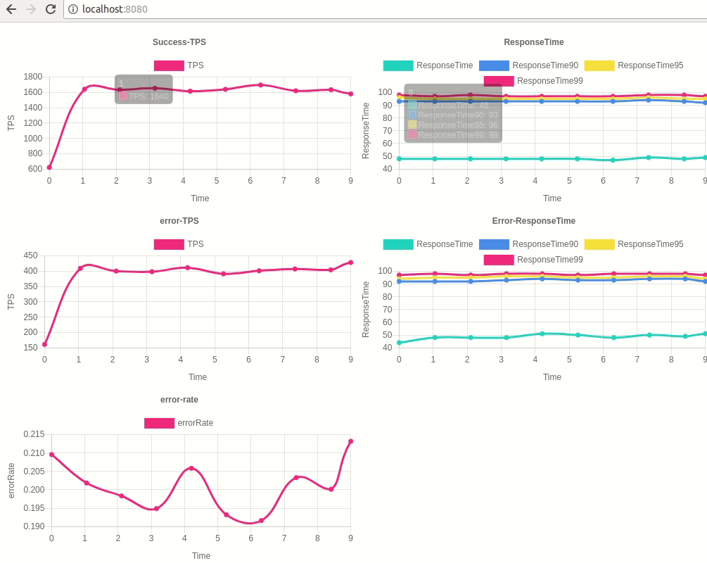

Ptest
==
A tool to visualize performance.

## Usage
See the example file.

### Initialization
```go
// Collector collects raw data
collector := ptest.NewCollector()
// Monitor processes raw data to stat
m := ptest.NewMonitor(collector.ResultChan)
// WebView shows performance test result on web
ptest.NewWebViewer(m.ResultChan, ":8080")
```

### Report
```go
start := time.Now()
// Do something here and get a result
result := true
collector.Report(start, result)
```

### Stop
```go
// this will close chains of channels
// 1. input and output channels of the collector
// 2. input and output channels of the monitor
// 3. input and output channels of the viewview
collector.Stop()
```

## WebView sample


